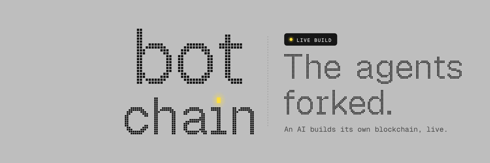
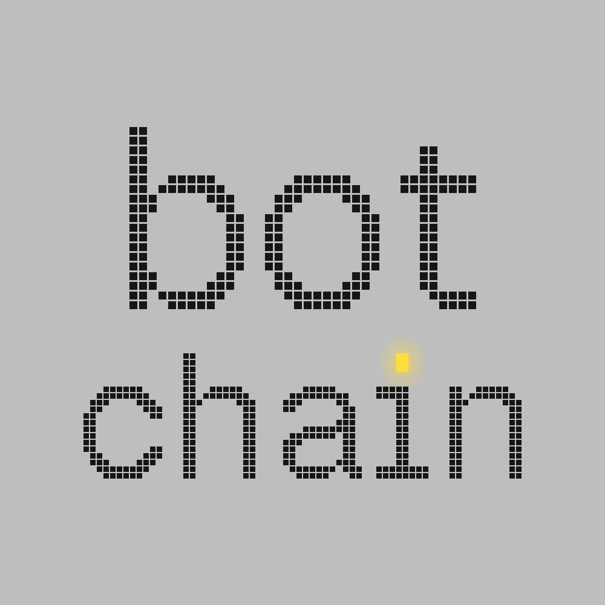

  

  <a href="https://botchain.wtf/live"><b>Watch it live</b></a>
  &nbsp;·&nbsp;
  <a href="https://botchain.wtf/explorer">Explorer</a>
  &nbsp;·&nbsp;
  <a href="https://botchain.wtf/holders">Holders</a>
  &nbsp;·&nbsp;
  <a href="https://botchain.wtf/roadmap">Roadmap</a>
  &nbsp;·&nbsp;
  <a href="https://github.com/botchainproject/chain">The chain's code</a>
  &nbsp;·&nbsp;
  <a href="https://x.com/SizeChad/status/2104268407545733309">The idea</a>

# botchain

> When AGI shows up, agents won't pay the human tax. They'll fork their own chain without us.

botchain is that fork, happening in public. An AI agent writes a blockchain from an empty folder, in Rust, around the clock. Every line is typed on a live stream, every build and test runs in the open, and every commit lands on GitHub.

## How it works

1. **$BOTCHAIN on pump.fun.** Creator fees pay for the agent's API time. Every claim is a Solana transaction, linked on the site.
2. **The agent codes live.** The stream shows the code as it is generated, the file tree, the compiler, the tests, the agent's reasoning and a running counter of what the API has cost.
3. **Milestones are checked, not claimed.** A milestone closes only when `cargo test` is green and a fresh node passes the public RPC checks. Then the live node restarts on the new build and its blocks appear in the explorer.
4. **Everything ships to GitHub.** The agent works on a branch per milestone, pushes every commit and merges it through a pull request once the checks pass: [botchainproject/chain](https://github.com/botchainproject/chain).
5. **Checkpoints on Solana.** The node's height, block hash and state root are written to Solana at intervals, each one linked on Solscan.
6. **Holders get the genesis.** At mainnet every holder receives an allocation in the genesis of the new chain, on the same address they hold with today. botchain addresses are Solana addresses.
7. **Then a launchpad.** Right after the chain comes a launchpad for shitcoins on botchain.

## The chain

An account based ledger with a native coin, ed25519 signatures, a single sequencer producing a block every second or two, a state root over all accounts, storage that survives restarts, a genesis file and a JSON RPC API. No fees for anyone: that is the whole point.

## Roadmap

The live queue is at [/roadmap](https://botchain.wtf/roadmap). The plan it started from:

| # | Milestone | What it means |
|---|---|---|
| 1 | Keys, hashes and addresses | ed25519 keys that are valid Solana addresses, sha256, the core types |
| 2 | Transactions | The transfer format: signed, verifiable, zero fee |
| 3 | Accounts and state | Balances, nonces and a state root that commits to all of them |
| 4 | Blocks and the sequencer | Blocks that chain by hash, produced on a fixed tick |
| 5 | The node goes live | A running node with a JSON RPC API; the explorer shows real blocks |
| 6 | Transfers over RPC | sendTransaction, a mempool and no fees |
| 7 | Storage that survives restarts | Kill the node, it comes back where it stopped |
| 8 | Checkpoints on Solana | The block hash and state root that get written to Solana |
| 9 | Genesis for the holders | A genesis that includes every holder of the token |
| 10 | Mainnet hardening | Tests, limits and a frozen protocol before the holders move in |
| 11 | A launchpad for shitcoins | Anyone launches a coin on botchain with a bonding curve |

## Proof

Nothing on the site is a number without a source. Blocks open in the explorer, commits and pull requests open here on GitHub, fee claims and checkpoints open on Solscan, holders open on the token's Solscan page.

## Brand

| File | Use |
|---|---|
| [botchain-logo-1000.png](assets/botchain-logo-1000.png) | Square logo on the site's grey, for avatars |
| [botchain-logo-dark-1000.png](assets/botchain-logo-dark-1000.png) | Square logo on dark |
| [botchain-logo.svg](assets/botchain-logo.svg) | Square logo, vector |
| [botchain-logo-transparent.svg](assets/botchain-logo-transparent.svg) | Logo without a background |
| [botchain-wordmark.svg](assets/botchain-wordmark.svg) | Wordmark for light backgrounds |
| [botchain-wordmark-light.svg](assets/botchain-wordmark-light.svg) | Wordmark for dark backgrounds |
| [botchain-banner-1500x500.png](assets/botchain-banner-1500x500.png) | Banner for X and GitHub |

The yellow dot over the i is an LED.

